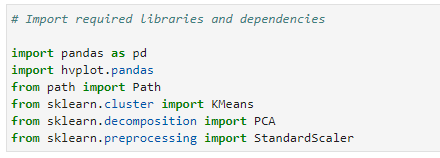
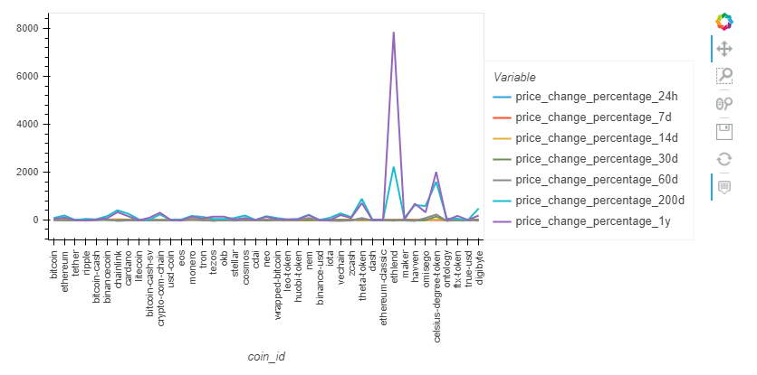
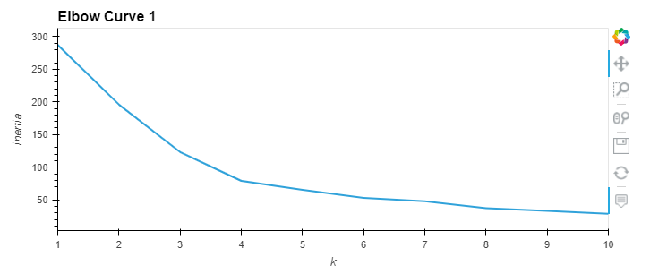
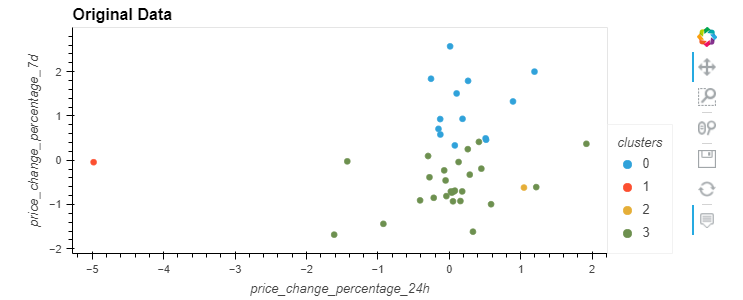
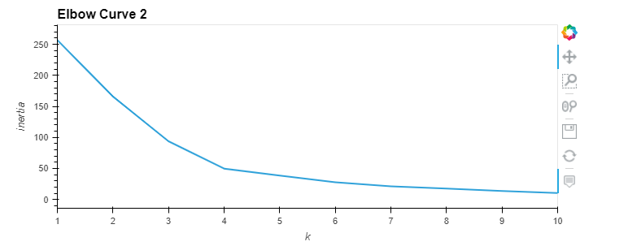
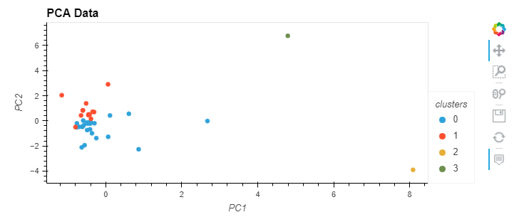

# fintech_challenge_10
This is an unsupervised machine learning program which utilizes eblow curves, KMeans analysis and PCA in order to analyze cryptocurrency price changes.

---
## Technologies
This program utilizes Jupyter Lab with the following libraries:

---
## Usage
First, a line graph is created using the csv data. This visualization compares various cryptocurrency's price change percentages.

Next, we utilize an elbow curve to find the best value for k using the orignal data. A range of 1 - 11 is used.

The optimal k value for the original data is four. We use this value to define the number of clusters used in the original data scatter plot.

A PCA model is used in order to help visualize the data. Before the program can create a PCA data scatter plot it must first create an eblow curve so we can determine the correct k value.

Finally, we determined that the optimal k value for the PCA data is four. Now the program creates a scatter plot for the PCA data.

---
## Contributors
Kevin Gross

---
## License
This program is covered under the MIT license.